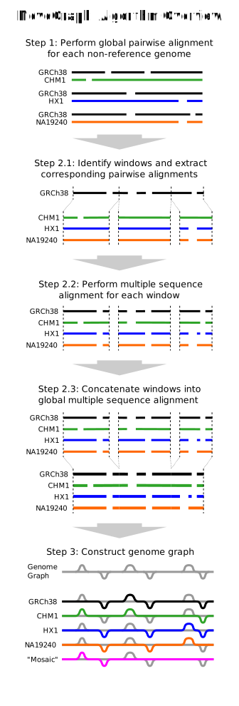

## NovoGraph: Genome Graph of Long-read *De Novo* Assemblies

An algorithmically novel approach to construct a genome graph representation of long-read-based *de novo* sequence assemblies. We then provide a proof of principle by creating a genome graph of seven ethnically-diverse human genomes.

### Motivation 

Employing a linear, monoploid reference genome is restrictive for genomic research, as such a reference both constrains and biases our understanding into the full diversity of subpopulation variation.  For regions of high allelic and structural diversity, such as the major histocompatibility complex (MHC) on chromosome 6 in humans, mapping reads to a one-dimensional character string results in poor genomic characterisation for individuals who carry a sequence that is either missing or highly divergent from the single reference. Motivated by the potential of genome graphs to address these shortcomings, we present a pipeline for constructing a graph genome from multiple *de novo* assemblies. 

The incentive for using *de novo* assembled genomes is to overcome the limitations posed by simply depending upon call sets derived from short-read sequencing. Constructing genome graphs using such call sets will result in genome graphs which contain SNPs but respectively few structural variants, especially large-scale structural variation. In order to correct this bias, our algorithm has been designed to employ *de novo* contigs directly---these contigs not only incorporate SNPs but instrinsically contain more structural variants and their breakpoints at base resolution. Using our approach, the resulting graph genome should be respectively enriched in large-scale structural variation. NovoGraph constructs a whole-genome graph by connecting the input assembly sequences at positions of homology; that is, it implements a model of homologous recombination between the input genomes.

### Genome Graph of Seven Human Assemblies

We then focused on building a graph genome composed of seven human assemblies. The following assemblies were included within the genome graph:

* AK1, Korean
* CHM1, European
* CHM13, European
* HG003, Ashkenazim
* HG004, Ashkenazim
* HX1, Han Chinese
* NA19240, Yoruba

Given that this genome graph has been designed to incorporate larger structural variation, we encourage this result to be used for future investigation and testing within the community.

### Genome Graph Construction Pipeline

#### Recent changes
(August 2019)
* NovoGraph now supports minimap2 for the initial mapping step and the PBSPro scheduler. The Bio::DB::HTS Perl module is not a dependency anymore.
* The primary input is now an unsorted BAM.

#### Inputs:
* reference file, [GRCh38_full_plus_hs38d1_analysis_set_minus_alts.fa](https://osf.io/py6kw/) (GRCh38 without ALTs)
* contigs file, allContigs.fa

#### Requirements:
* SAMtools version >= 1.6
* BWA version >= 0.7.15
* MAFFT version >= 7
* Perl dependencies: 
    * Set::IntervalTree, https://metacpan.org/release/Set-IntervalTree
    
#### Quick start:

```
perl suggestCommands.pl --inputContigs allContigs.fa --referenceGenome GRCh38_full_plus_hs38d1_analysis_set_minus_alts.fa --outputDirectory myGraph > commands_for_myGraph.txt
```

This will produce a file `commands_for_myGraph.txt`, which will contain the commands for a complete NovoGraph run.


Some important notes:
* The commands produced by `suggestCommands.pl` are not meant for fully automated execution - instead, execute the commands manually (at least when you run NovoGraph for the first time), and read the integrated comments. The comments will also tell you how to use minimap2 or a PBSPro scheduling system.
* The utilized reference genome (here: `GRCh38_full_plus_hs38d1_analysis_set_minus_alts.fa`) should always be a primary reference, i.e. it should not contain any ALT contigs. You can, however, include the ALT contigs in your input file (here: `allContigs.fa`).

#### Preparation:
*Note*: The following commands assume you are in the `scripts` directory of NovoGraph, and most intermediate output also goes there. In most circumstances, it is preferable to use a dedicated output directory. When using `suggestCommands.pl`, this is specified as a parameter.


```
## Index the reference FASTA
bwa index GRCh38_full_plus_hs38d1_analysis_set_minus_alts.fa

## Align the contigs FASTA against the reference, outputting a single BAM
bwa mem GRCh38_full_plus_hs38d1_analysis_set_minus_alts.fa allContigs.fa  | samtools view -Sb - > allContigs_unsorted.bam

## Check that there are no unmapped reads in the input BAM, as this might lead to unknown behaviour
samtools view -c -f 0x4 allContigs_unsorted.bam

## If there is no output with the above command, continue. 
## Otherwise, if you do find unmapped reads in the input BAM,
## please remove these as follows and use 'SevenGenomes.filtered.bam' for the remainder of the pipeline
samtools view -F 0x4 -bo allContigs_unsorted.filtered.bam allContigs_unsorted.bam

## Finally, check that these inputs are in the correct format for the MAFFT
perl checkBAM_SVs_and_INDELs.pl --BAM allContigs_unsorted.bam
                                --referenceFasta GRCh38_full_plus_hs38d1_analysis_set_minus_alts.fa 
                                --readsFasta allContigs.fa
								--sam2alignment_executable ../src/sam2alignment
```

<p align="center">
  
</p>


##### Step 1: Find global alignments between individual input contigs and GRCh38

```
## Execute BAM2ALIGNMENT.pl
## This first step will output a text file '*.sortedWithHeader' which is to be input into the next script, FIND_GLOBAL_ALIGNMENTS.pl
## (Here we place outputs into the subdirectory '../intermediate_files'.)
perl BAM2ALIGNMENT.pl --BAM allContigs_unsorted.bam
                      --referenceFasta GRCh38_full_plus_hs38d1_analysis_set_minus_alts.fa 
                      --readsFasta allContigs.fa 
                      --outputFile ../intermediate_files/AlignmentInput.txt
					  --sam2alignment_executable ../src/sam2alignment

## Output:
## AlignmentInput.txt.sortedWithHeader


## Next, we perform local to global alignment with the calculation of a global alignment matrix. 
## The combined output for all contigs from all input assemblies is represented in a single SAM/CRAM file.
perl FIND_GLOBAL_ALIGNMENTS.pl --alignmentsFile ../intermediate_files/AlignmentInput.sortedWithHeader 
                               --referenceFasta GRCh38_full_plus_hs38d1_analysis_set_minus_alts.fa 
                               --outputFile forMAFFT.bam 
                               --outputTruncatedReads ../intermediate_files/truncatedReads 
                               --outputReadLengths ../intermediate_files/postGlobalAlignment_readLengths
                               --CIGARscript_path dealWithTooManyCIGAROperations.pl

## Output:
## forMAFFT.bam


## Provides diagnostics to validate that the resulting BAM is correct
perl countExpectedGlobalAlignments.pl --BAM forMAFFT.bam
```

##### Step 2: Multiple Sequence Alignment (MSA) computation
```
## Execute BAM2MAFFT.pl
perl BAM2MAFFT.pl --BAM forMAFFT.bam 
                  --referenceFasta GRCh38_full_plus_hs38d1_analysis_set_minus_alts.fa 
                  --readsFasta allContigs.fa 
                  --outputDirectory .../intermediate_files/forMAFFT 
                  --inputTruncatedReads .../intermediate_files/truncatedReads 

## The next step is to execute CALLMAFFT.pl
## This step assumes you are using the Sun Grid Engine (SGE) job scheduler to submit jobs
## If you use PBSPro, you can also add arguments like the following (modified for your local environment):
##    --PBSPro 1 --PBSPro_select 'select=1:ncpus=16:mem=48GB' --PBSPro_A IMMGEN --preExec 'module load Perl; module load SamTools; module load Mafft/7.407' --chunkSize 500
## The --chunkSize parameter can be used to control the number of multiple sequence alignments combined into a single cluster job
## (i.e. larger --chunkSize values lead to fewer submitted jobs)
perl CALLMAFFT.pl --action kickOff --mafftDirectory .../intermediate_files/forMAFFT --qsub 1
                  --mafft_executable /mafft/mafft-7.273-with-extensions/install/bin/mafft 
                  --fas2bam_path fas2bam.pl --samtools_path /usr/local/bin/samtools --bamheader windowbam.header.txt

## This script also contains commands to check submitted jobs and re-submit if necessary
perl CALLMAFFT.pl --action check --mafftDirectory .../intermediate_files/forMAFFT
                  --mafft_executable /mafft/mafft-7.273-with-extensions/install/bin/mafft 
                  --fas2bam_path fas2bam.pl --samtools_path /usr/local/bin/samtools --bamheader windowbam.header.txt
perl CALLMAFFT.pl --action reprocess --mafftDirectory .../intermediate_files/forMAFFT
                  --mafft_executable /mafft/mafft-7.273-with-extensions/install/bin/mafft 
                  --fas2bam_path fas2bam.pl --samtools_path /usr/local/bin/samtools --bamheader windowbam.header.txt
perl CALLMAFFT.pl --action processChunk --mafftDirectory .../intermediate_files/forMAFFT --chunkI 0
                  --mafft_executable /mafft/mafft-7.273-with-extensions/install/bin/mafft 
                  --fas2bam_path fas2bam.pl --samtools_path /usr/local/bin/samtools --bamheader windowbam.header.txt
                  
## If there are still individual alignment jobs that don't complete successfully, try adding --usePreClustering 1.
## When --usePreClustering is active, the algorithm will try increasingly aggressive multiple sequence alignment strategies. 
perl CALLMAFFT.pl --action reprocess --mafftDirectory .../intermediate_files/forMAFFT
                  --mafft_executable /mafft/mafft-7.273-with-extensions/install/bin/mafft 
                  --fas2bam_path fas2bam.pl --samtools_path /usr/local/bin/samtools --bamheader windowbam.header.txt
				  --usePreClustering 1
				  
## 
## Note: For the majority of use cases, this file 'windowbam.header.txt' should remain untouched. 
## Users should use the file 'windowbam.header.txt' as provided, unless there are assemblies with contigs 
## longer than chr1 in hg38, 248956422 bp. In this case, please change this value to be the size of the largest contig. 

## Next, we concatenate windows into a global MSA, outputting a single SAM file
perl globalize_windowbams.pl --fastadir .../intermediate_files/forMAFFT/ 
                             --msadir .../intermediate_files/forMAFFT/ 
                             --contigs .../intermediate_files/postGlobalAlignment_readLengths 
                             --output combined.sam


# Convert SAM to CRAM, and then index
samtools view -h -t GRCh38.headerfile.txt combined.sam > combined_with_header.sam
samtools sort combined_with_header.sam -o combined_with_header_sorted.sam
cat combined_with_header_sorted.sam | samtools view -C -T GRCh38_full_plus_hs38d1_analysis_set_minus_alts.fa - > combined.cram
samtools index combined.cram


## Validate that the CRAM is correct
perl checkMAFFT_input_and_output.pl --MAFFTdir .../intermediate_files/forMAFFT/ 
                                    --contigLengths .../intermediate_files/postGlobalAlignment_readLengths
                                    --preMAFFTBAM forMAFFT.bam 
                                    --finalOutputCRAM combined.cram
                                    --fas2bam_path fas2bam.pl
                                    --samtools_path /usr/local/bin/samtools
                                    --bamheader windowbam.header.txt
```

##### Step 3: Compute an acyclic directed graph structure from the global MSA
```
## First, users are required compile the *cpp code within /src to create the executable 'CRAM2VCF'. 
## In order to successfully compile this code, execute 'make all' within /src
## Users then must link to this executable when running the script CRAM2VCF.pl

## Now we convert the CRAM into a VCF 
perl CRAM2VCF.pl --CRAM combined.cram 
                 --referenceFasta GRCh38_full_plus_hs38d1_analysis_set_minus_alts.fa 
                 --prefix graph 
                 --contigLengths .../intermediate_files/postGlobalAlignment_readLengths
                 --CRAM2VCF_executable ../src/CRAM2VCF
				 --sam2alignment_executable ../src/sam2alignment


## Next, execute launch_CRAM2VCF_C++.pl
perl launch_CRAM2VCF_C++.pl --prefix graph


## Finally, run CRAM2VCF_createFinalVCF.pl 
perl CRAM2VCF_createFinalVCF.pl --CRAM combined.cram 
                                --referenceFasta GRCh38_full_plus_hs38d1_analysis_set_minus_alts.fa 
                                --prefix graph
```

### Instructions to Download and Process Input Human Assemblies

The following commands were used to download the assembly FASTAs used for this project:

```
## AK1, Korean:
for file in `echo LPVO02.1.fsa_nt.gz LPVO02.2.fsa_nt.gz LPVO02.3.fsa_nt.gz LPVO02.4.fsa_nt.gz LPVO02.5.fsa_nt.gz LPVO02.6.fsa_nt.gz`; do wget ftp://ftp.ncbi.nlm.nih.gov/sra/wgs_aux/LP/VO/LPVO02/$file; done

## CHM1, European:
for file in `echo LJII01.1.fsa_nt.gz LJII01.10.fsa_nt.gz LJII01.11.fsa_nt.gz LJII01.12.fsa_nt.gz LJII01.13.fsa_nt.gz LJII01.14.fsa_nt.gz LJII01.15.fsa_nt.gz LJII01.2.fsa_nt.gz LJII01.3.fsa_nt.gz LJII01.4.fsa_nt.gz LJII01.5.fsa_nt.gz LJII01.6.fsa_nt.gz LJII01.7.fsa_nt.gz LJII01.8.fsa_nt.gz LJII01.9.fsa_nt.gz`; do echo $file; wget ftp://ftp.ncbi.nlm.nih.gov/sra/wgs_aux/LJ/II/LJII01/$file; done
 
## CHM13, European:
for file in `echo LDOC03.1.fsa_nt.gz LDOC03.2.fsa_nt.gz LDOC03.3.fsa_nt.gz LDOC03.4.fsa_nt.gz LDOC03.5.fsa_nt.gz LDOC03.6.fsa_nt.gz LDOC03.7.fsa_nt.gz`; do echo $file; wget ftp://ftp.ncbi.nlm.nih.gov/sra/wgs_aux/LD/OC/LDOC03/$file; done

## HX1, Han Chinese:
wget http://hx1.wglab.org/data/hx1f4.3rdfixedv2.fa.gz

## HG003, Ashkenazim father:
wget ftp://ftp-trace.ncbi.nlm.nih.gov/giab/ftp/data/AshkenazimTrio/analysis/MtSinai_PacBio_Assembly_falcon_03282016/hg003_p_and_a_ctg.fa
 
## HG004, Ashkenazim mother:
wget ftp://ftp-trace.ncbi.nlm.nih.gov/giab/ftp/data/AshkenazimTrio/analysis/MtSinai_PacBio_Assembly_falcon_03282016/hg004_p_and_a_ctg.fa

## NA19240, Yoruba:
for file in `echo LKPB01.1.fsa_nt.gz LKPB01.2.fsa_nt.gz LKPB01.3.fsa_nt.gz LKPB01.4.fsa_nt.gz LKPB01.5.fsa_nt.gz LKPB01.6.fsa_nt.gz`; do wget ftp://ftp.ncbi.nlm.nih.gov/sra/wgs_aux/LK/PB/LKPB01/$file; done
```
Upon the successful download of these FASTAs, users should concatenate the individual assemblies into a single FASTA, `allContigs.fa`.

### Data Availability

The genome graph of seven ethnically diverse human genomes can be accessed at the following Open Science Framework (OSF) project, [NovoGraph](https://osf.io/3vs42/?view_only=fedd8437d96c4d688f6c40150903d857)

* **NovoGraph-Simple-VCF** [novograph_simple_v1.vcf.gz](https://osf.io/pgq52/?view_only=fedd8437d96c4d688f6c40150903d857) (202.6 MB)

    The genome graphs of seven ethnically diverse human genomes in VCF format, overlapping variant alleles 
    
* **NovoGraph-Universal-VCF** [novograph_universal_v1.vcf.gz](https://osf.io/t5czk/?view_only=fedd8437d96c4d688f6c40150903d857) (588.3 MB)

    The genome graphs of seven ethnically diverse human genomes in VCF format, non-overlapping variant alleles 

* **NovoGraph CRAM** [novograph_v1.cram](https://osf.io/jhbwx/?view_only=fedd8437d96c4d688f6c40150903d857) (212.2 MB)

    The global multiple sequence of all input sequences in CRAM format 


### Contributors

* Evan Biederstedt (NYGC, WCM)
* Alexander Dilthey (NHGRI-NIH, HHU/UKD)
* Nathan Dunn (LBNL)
* Aarti Jajoo (Baylor)
* Nancy Hansen (NIH)
* Jeff Oliver (Arizona)
* Andrew Olson (CSHL)

This project was initiated at an NCBI-style hackathon held before the 2016 Biological Data Science meeting at Cold Spring Harbor Laboratory in October, 2016.

### Citation

Biederstedt E, Oliver JC, Hansen NF, Jajoo A, Dunn N, Olson A, Busby B, Dilthey AT  
NovoGraph: Genome graph construction from multiple long-read de novo assemblies.  
[F1000Research 2018, 7:1391 (doi: 10.12688/f1000research.15895.2)](https://f1000research.com/articles/7-1391/v2)

